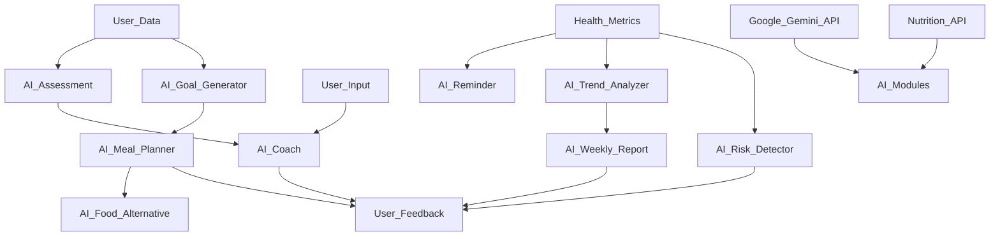

# AI Architecture

HealthGuard's core intelligence is driven by a suite of AI modules, primarily powered by the Google Gemini API and a Nutrition API. These modules work in concert to provide a personalized and proactive health coaching experience. Each module is designed with clear purposes, defined inputs and outputs, robust prompt flows, fallback strategies, and considerations for future improvements.

## 1. AI Assessment

-   **Purpose:** To understand the user's initial health status, lifestyle, dietary preferences, and existing conditions.
-   **Inputs:** User-provided health questionnaire data (age, weight, height, activity level, dietary restrictions, health goals, current medications, existing conditions).
-   **Outputs:** A comprehensive user health profile, initial health scores, potential risk factors, and personalized baseline recommendations.
-   **Prompt Flow:**
    1.  **Initial Query:** Gemini receives structured user health data.
    2.  **Analysis Prompt:** "Analyze the provided health data. Identify key lifestyle factors, potential health risks (especially related to diabetes), and suggest initial health goals. Focus on understanding dietary habits, activity levels, and stress indicators."
    3.  **Refinement/Clarification (if needed):** Gemini may generate follow-up questions to clarify ambiguous data or gather more context from the user.
    4.  **Profile Generation:** Gemini synthesizes the information into a comprehensive health profile and initial recommendations.
-   **Fallback Strategy:** If Gemini API fails or returns ambiguous results, use default health recommendations based on basic demographic data (age, gender, BMI) and provide a prompt for manual input or re-submission.
-   **Future Improvements:** Integrate with more advanced medical knowledge graphs, real-time health sensor data (from Google Health Connect/Apple Health), and predictive analytics for more precise risk detection.

## 2. AI Goal Generator

-   **Purpose:** To assist users in setting realistic, achievable, and personalized health goals based on their assessment and preferences.
-   **Inputs:** User health profile (from AI Assessment), user-defined preferences (e.g., "lose weight," "eat healthier," "increase activity"), current health trends.
-   **Outputs:** A set of SMART (Specific, Measurable, Achievable, Relevant, Time-bound) health goals, broken down into smaller milestones.
-   **Prompt Flow:**
    1.  **Goal Setting Query:** Gemini receives the user's health profile and high-level goals.
    2.  **SMART Goal Prompt:** "Based on the user's health profile and their stated preference of [user_preference], generate 3-5 SMART goals. Each goal should include specific metrics, a clear timeline, and a rationale for its achievability and relevance to diabetes prevention. Break down each goal into 2-3 actionable milestones."
    3.  **User Review/Adjustment:** Present proposed goals to the user for feedback and allow adjustments.
    4.  **Goal Finalization:** Gemini refines goals based on user input.
-   **Fallback Strategy:** If API fails, provide a pre-defined list of common health goals for diabetes prevention and encourage manual selection and customization.
-   **Future Improvements:** Incorporate motivational psychology principles to optimize goal phrasing, integrate with behavioral economics for nudges, and dynamically adjust goals based on real-time progress and challenges.

## 3. AI Meal Planner

-   **Purpose:** To create personalized, healthy meal plans that align with user goals, dietary preferences, and learned favorite foods, focusing on diabetes-friendly options.
-   **Inputs:** User health profile, active health goals, favorite foods, dietary restrictions, calorie targets (if specified), recent food logs, Nutrition API data.
-   **Outputs:** Daily or weekly meal plans with detailed recipes, nutritional information, and healthier alternatives for specific items.
-   **Prompt Flow:**
    1.  **Meal Plan Request:** Gemini receives user profile, goals, and dietary constraints.
    2.  **Recipe Generation/Selection Prompt:** "Generate a 7-day meal plan for [user_name] (health profile: [health_profile_summary], goals: [active_goals], dietary restrictions: [dietary_restrictions], favorite foods: [favorite_foods]). Ensure meals are diabetes-friendly, balanced, and consider [calorie_target] calories/day. Integrate favorite foods where appropriate and suggest diverse options. Provide nutritional breakdown for each meal."
    3.  **Nutrition API Integration:** Before outputting, cross-reference generated meals with Nutrition API to validate nutritional data and caloric content.
    4.  **Alternative Suggestions (if needed):** If a meal is high in certain undesirable nutrients, prompt Gemini to suggest healthier alternatives.
-   **Fallback Strategy:** Provide a generic 3-day diabetes-friendly meal plan template and allow manual customization. Suggest external recipe resources.
-   **Future Improvements:** Real-time grocery list generation, integration with food delivery services, dynamic adjustment based on meal satisfaction and energy levels, advanced recipe customization (e.g., ingredient swaps).

## 4. AI Food Alternative

-   **Purpose:** To recommend healthier, diabetes-friendly alternatives to user-specified foods or ingredients.
-   **Inputs:** User-specified food item, user health profile, dietary restrictions, Nutrition API data.
-   **Outputs:** A list of 2-3 healthier alternatives with a brief explanation of why they are better and their nutritional comparison.
-   **Prompt Flow:**
    1.  **Alternative Request:** Gemini receives the food item and user context.
    2.  **Alternative Suggestion Prompt:** "Suggest 3 healthier, diabetes-friendly alternatives to [food_item] for [user_name] (dietary restrictions: [dietary_restrictions]). Explain why each alternative is better and provide a brief nutritional comparison (e.g., lower sugar, higher fiber)."
    3.  **Nutrition API Validation:** Validate nutritional data of alternatives using Nutrition API.
-   **Fallback Strategy:** Provide a general guideline on choosing healthier options (e.g., "choose whole grains over refined, lean proteins over processed meats").
-   **Future Improvements:** Image recognition for food items to automatically suggest alternatives, personalized alternative suggestions based on user's past preferences and feedback.

## 5. AI Coach

-   **Purpose:** To provide personalized motivation, guidance, and support to users, acting as a digital health coach.
-   **Inputs:** User progress towards goals, recent health logs, AI insights, detected risks, user interactions/questions.
-   **Outputs:** Motivational messages, actionable advice, answers to health-related questions, personalized nudges.
-   **Prompt Flow:**
    1.  **Contextual Input:** Gemini receives updates on user progress, setbacks, or direct questions.
    2.  **Coaching Prompt (Progress):** "The user has made [progress_summary] towards their goal of [goal_name]. Generate a motivational and encouraging message, acknowledging their effort and suggesting a next small step."
    3.  **Coaching Prompt (Setback):** "The user is struggling with [challenge_description]. Offer empathetic support, identify potential reasons for the setback, and suggest coping strategies or alternative approaches."
    4.  **Question Answering Prompt:** "Answer the user's question: '[user_question]'. Provide a concise, accurate, and easy-to-understand response, referring to their health profile if relevant."
-   **Fallback Strategy:** Provide generic encouraging messages or direct users to a FAQ section for common health questions.
-   **Future Improvements:** Advanced sentiment analysis of user input to tailor emotional support, proactive intervention based on predictive models of disengagement, integration with mental health resources.

## 6. AI Reminder

-   **Purpose:** To send timely and personalized reminders for activities, medication, appointments, or re-engaging with the app.
-   **Inputs:** User's schedule, medication adherence data, activity logs, upcoming appointments, app usage patterns, AI insights.
-   **Outputs:** Personalized reminder messages delivered via notifications.
-   **Prompt Flow:**
    1.  **Reminder Trigger:** A scheduled event (e.g., mealtime, medication time) or system-detected inactivity triggers Gemini.
    2.  **Reminder Message Prompt:** "Generate a friendly reminder for [user_name] to [action] at [time]. Tailor the tone to be encouraging and supportive, linking back to their goals if appropriate."
-   **Fallback Strategy:** Use generic, pre-written reminder templates if API fails.
-   **Future Improvements:** Adaptive reminder scheduling based on user's response to previous reminders, context-aware reminders (e.g., suggesting a walk when the user is near a park).

## 7. AI Trend Analyzer

-   **Purpose:** To analyze historical health data, identify patterns, trends, and deviations, and generate insights.
-   **Inputs:** Continuous stream of health metrics (blood sugar, weight, activity, food logs, sleep data).
-   **Outputs:** Identification of positive/negative health trends, correlations between different metrics, potential early warning signs.
-   **Prompt Flow:**
    1.  **Data Ingestion:** Gemini receives new health data points.
    2.  **Trend Analysis Prompt:** "Analyze the historical health data for [user_name] over the past [time_period]. Identify significant trends in [metric1], [metric2], etc. Look for correlations between different metrics (e.g., diet and blood sugar). Highlight any deviations from healthy ranges or established patterns and explain their potential implications."
    3.  **Insight Generation:** Gemini summarizes findings into actionable insights.
-   **Fallback Strategy:** Simple statistical summaries (min, max, average) for each metric if AI fails.
-   **Future Improvements:** Real-time anomaly detection, predictive modeling for future health trends, personalized risk scores based on complex inter-dependencies of data.

## 8. AI Weekly Report

-   **Purpose:** To generate comprehensive, personalized weekly reports summarizing user progress, insights, and recommendations.
-   **Inputs:** AI Assessment data, AI Goal Generator data, AI Meal Planner data, AI Food Alternative data, AI Coach interactions, AI Reminder data, AI Trend Analyzer data, AI Risk Detector data.
-   **Outputs:** A structured weekly report with a summary of achievements, areas for improvement, key insights, and actionable recommendations for the upcoming week.
-   **Prompt Flow:**
    1.  **Report Compilation:** Gemini gathers data from all other AI modules for the past week.
    2.  **Report Generation Prompt:** "Compile a weekly health report for [user_name]. Summarize their progress towards goals, highlight key achievements, and identify areas needing improvement. Include personalized insights from trend analysis and any detected risks. Provide 3-5 actionable recommendations for the next week, tailored to their current status and goals."
-   **Fallback Strategy:** Provide a basic template for a weekly report that summarizes raw data without AI-driven insights.
-   **Future Improvements:** Interactive reports with customizable views, personalized data visualization, integration with printable PDF generation.

## 9. AI Risk Detector

-   **Purpose:** To proactively identify potential health risks (especially related to diabetes complications) based on continuous monitoring of user health data.
-   **Inputs:** Health metrics (blood sugar, weight, blood pressure, activity levels), AI Assessment, AI Trend Analyzer insights, medical guidelines.
-   **Outputs:** Early warning signals, severity assessment, and immediate actionable advice or recommendations for medical consultation.
-   **Prompt Flow:**
    1.  **Risk Monitoring:** Gemini continuously monitors incoming health data and trend analysis.
    2.  **Risk Detection Prompt:** "Analyze the latest health data for [user_name]. Compare current metrics and trends against established diabetes risk thresholds and medical guidelines. If [risk_condition] is detected (e.g., sustained high blood sugar, rapid weight gain/loss), assess its severity and generate an urgent alert message. Include immediate actionable advice and recommend seeking medical consultation if necessary."
-   **Fallback Strategy:** Set up rule-based alerts for critical thresholds (e.g., blood sugar > X for Y days) without AI interpretation.
-   **Future Improvements:** Integration with predictive models for pre-diabetes progression, genetic predisposition analysis, real-time integration with emergency services (with user consent).