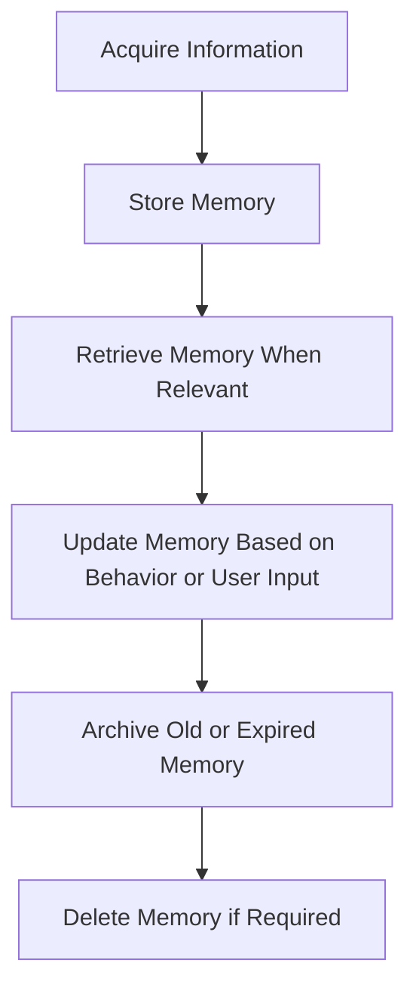
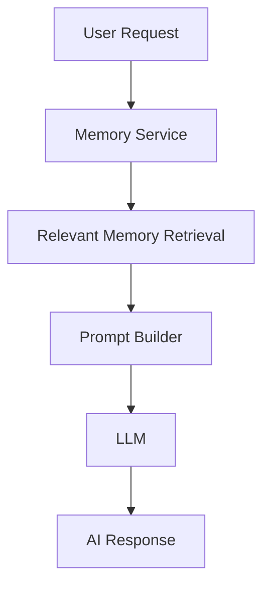

# HealthGuard v2.0 — AI Memory Documentation

**Document Type:** AI Memory Specification (Extension to AI Workflow)
**Product:** HealthGuard — AI Lifestyle Companion for Diabetes Prevention
**Scope:** Defines how the AI stores, retrieves, updates, prioritizes, and removes user information to support personalization over time, in alignment with the workflows described in AI_WORKFLOW.md.

This document extends AI_WORKFLOW.md. It does not replace it.

---

## 1. Purpose

AI memory is required because HealthGuard is an AI Lifestyle Companion, not a chatbot. The AI must be able to remember what matters to the user so that coaching remains consistent, relevant, and personalized over time.

Personalization is impossible without memory. Without remembering preferences, accepted suggestions, rejected suggestions, goals, and lifestyle patterns, the AI would have to treat every interaction as a new conversation and would be unable to adapt its guidance in a meaningful way.

Memory exists to improve coaching continuity, not to create a human-like relationship or simulate personal identity beyond the user's stated preferences and behavior.

---

## 2. Memory Philosophy

The AI:

- remembers user preferences
- remembers accepted recommendations
- remembers rejected recommendations
- never remembers unnecessary temporary data
- never stores medical diagnosis
- never invents memories
- always updates memories based on user behavior

Memory should support better coaching decisions. It should remain precise, selective, and grounded in what the user has actually expressed or repeatedly demonstrated.

---

## 3. Memory Categories

### Short-Term Memory

Short-term memory holds information that is relevant only for the immediate session or the current day.

Examples:
- Today's Goal
- Today's Meal Plan
- Today's Meal Completion
- Today's Reminder
- Current Conversation Context

**Lifetime:**
- Short-term memory remains active only for the current interaction, the current day, or until the context becomes obsolete.

**Update frequency:**
- It is updated frequently throughout the day as the user interacts with the AI.

**Expiration:**
- It expires when the discussion context changes, the day progresses, or the information is no longer relevant.

### Long-Term Memory

Long-term memory holds stable personal information that can improve future coaching across multiple sessions.

Examples:
- Health Persona
- Favorite Foods
- Favorite Drinks
- Favorite Snacks
- Disliked Foods
- Accepted Alternatives
- Rejected Alternatives
- Lifestyle Preferences
- Goals
- Weekly Progress
- Coaching Style
- Reminder Preferences

**Lifetime:**
- Long-term memory persists across sessions until it is explicitly changed, removed, or archived.

**Update rules:**
- It is updated when the user clearly changes preferences.
- It is updated when repeated behavior indicates a stable pattern.
- It is updated conservatively so the AI does not overfit to a single interaction.

**Why each exists:**
- These memories help the AI tailor recommendations, tone, meal suggestions, reminders, and progress reviews without needing to ask the same questions repeatedly.

---

## 4. Memory Lifecycle

Memory follows a clear lifecycle from observation to removal.

Acquire

↓

Store

↓

Retrieve

↓

Update

↓

Archive

↓

Delete (if required)



### Lifecycle Notes

- Acquire: the AI gathers information from the current conversation, user behavior, or explicit preference changes.
- Store: the information is saved only if it meets the memory rules and is relevant to coaching.
- Retrieve: the AI uses the memory when it is relevant to the current task or conversation.
- Update: the AI revises memory when the user changes an opinion, repeatedly accepts or rejects an option, or changes a goal.
- Archive: older or temporary records are moved out of active use without being discarded immediately.
- Delete: memory is removed when it is outdated, unnecessary, or requested by the user.

---

## 5. Memory Retrieval Rules

The AI retrieves memories only when they are relevant to the current coaching task.

### What memories are always retrieved

The AI always considers the following when relevant:
- Health Persona
- Goals
- Favorite Foods
- Current Week Summary
- Current Meal Plan

### What memories are optional

The AI may retrieve supporting memories when helpful, such as:
- Reminder Preferences
- Accepted Alternatives
- Rejected Alternatives
- Recent coaching context

### What memories are ignored

The AI ignores memories that are:
- temporary and no longer relevant
- unrelated to health or lifestyle coaching
- private or sensitive outside the defined health context
- unverified or speculative

### Retrieval priority

The AI should prioritize memory in this order:
1. Health Persona
2. Goals
3. Favorite Foods
4. Current Week Summary
5. Current Meal Plan

The AI should never retrieve unnecessary historical data when a lighter, more relevant memory set is sufficient.

---

## 6. Memory Update Rules

Memory is updated when the user clearly changes their preferences or when repeated behavior shows a stable pattern.

### When memory is updated

Examples:
- User changes favorite food.
- User repeatedly rejects oatmeal.
- User consistently accepts grilled chicken.
- User changes goal.
- User changes reminder time.

### Update strategy

- Explicit user input is the strongest signal.
- Repeated behavior may strengthen or revise memory over time.
- The AI should avoid changing memory from a single isolated event unless the user clearly states it.
- The AI should update memory in a way that improves future coaching without becoming overly rigid.

### Examples of update behavior

- If the user says, "I prefer brown rice," the memory should be updated to reflect brown rice as a preferred food.
- If the user repeatedly rejects oatmeal, the AI should record it as a disliked or rejected food preference.
- If the user consistently accepts grilled chicken as a meal alternative, that pattern may be stored as an accepted alternative.

---

## 7. Memory Priority

Memories are ranked by importance to ensure the AI uses the most relevant information first.

### Priority 1
- Health Profile
- Goals
- Food Allergies

These are the most important because they directly affect safety, relevance, and coaching decisions.

### Priority 2
- Health Persona

This shapes the coaching tone and style and helps the AI personalize communication.

### Priority 3
- Favorite Foods

These are important for meal planning and recommendation alignment.

### Priority 4
- Accepted Alternatives

These help the AI suggest substitutions that the user is likely to accept.

### Priority 5
- Reminder Preferences

These influence when and how the AI nudges the user.

### Priority 6
- Conversation Summaries

These are lower priority because they support context but are less essential than direct preferences and goals.

---

## 8. Memory Expiration

Some memories are temporary and expire quickly, while others remain active until changed.

### Memories that expire

Examples:
- Today's Reminder
- Today's Context
- Temporary Meal Session

These should be considered temporary and should not persist beyond their useful window.

### Memories that do not expire unless edited

Examples:
- Favorite Foods
- Health Persona
- Goals
- Lifestyle Preferences

These represent stable user characteristics and should remain available across sessions until the user changes them.

### Progress-related memory

Weekly progress may be retained as part of the current week summary and archived as the week changes.

---

## 9. Privacy Rules

The AI must handle memory carefully and responsibly.

The AI must:
- never store passwords
- never store authentication tokens
- never store private conversations unrelated to health
- never fabricate memories
- allow users to edit or remove remembered preferences

The AI should only store information that supports health and lifestyle coaching within the scope of HealthGuard.

---

## 10. Memory Sources

Memory is created or updated by the same workflows that produce the user-facing coaching experience in AI_WORKFLOW.md.

| Workflow | Memory Created or Updated |
| --- | --- |
| Onboarding Workflow | Health Persona, Goals, Favorite Foods, Favorite Drinks, Favorite Snacks, Lifestyle Preferences, initial Reminder Preferences |
| Daily Workflow | Today's Goal, Today's Meal Plan, Today's Reminder, Current Conversation Context, Weekly Progress |
| Meal Planner Workflow | Current Meal Plan, Accepted Alternatives, Rejected Alternatives, Favorite Foods-based preferences |
| Food Alternative Workflow | Accepted Alternatives, Rejected Alternatives, current meal context |
| Daily Reminder / Coaching Touchpoints | Reminder Preferences, current reminder state, short-term coaching context |

The AI should not create memory from isolated or irrelevant interactions. Memory should be created only when it supports later personalization under the defined workflows.

---

## 11. Memory Schema

The following schema examples are conceptual representations only. They describe the intended meaning of each memory category and do not define a database schema.

### Health Persona

```json
{
  "type": "health_persona",
  "summary": "Busy professional, moderate activity, prefers home-cooked meals",
  "tone": "supportive and practical",
  "confidence": 0.92
}
```

### Goals

```json
{
  "type": "goals",
  "items": [
    {
      "name": "Increase hydration",
      "status": "active",
      "priority": 1
    },
    {
      "name": "Eat more vegetables",
      "status": "active",
      "priority": 2
    }
  ]
}
```

### Favorite Foods

```json
{
  "type": "favorite_foods",
  "items": [
    "brown rice",
    "grilled chicken",
    "steamed broccoli"
  ],
  "confidence": 0.88
}
```

### Reminder Preferences

```json
{
  "type": "reminder_preferences",
  "time": "07:30",
  "frequency": "daily",
  "channel": "in_app",
  "confidence": 0.9
}
```

### Coaching Style

```json
{
  "type": "coaching_style",
  "tone": "gentle and encouraging",
  "approach": "small gradual steps",
  "confidence": 0.85
}
```

---

## 12. Memory Confidence

The AI assigns confidence to remembered preferences based on how strongly the information is supported.

- Explicit user statements have the highest confidence.
- Repeated behavior gradually increases confidence.
- A single interaction should not permanently change long-term memory.
- Confidence is used to decide whether a memory should be treated as stable or provisional.

Example:
- A direct statement such as "I prefer brown rice" is high-confidence memory.
- A user accepting grilled chicken several times over several days increases confidence in that preference.
- A single rejection of one meal should not immediately become a permanent dislike unless it is repeated or confirmed.

---

## 13. Conflict Resolution

Conflicts may occur when new input disagrees with existing memory.

The AI resolves conflicts in this order:
1. Explicit user statement
2. Repeated recent behavior
3. Existing stored memory

This ensures that the AI respects the user's current intent before relying on historical patterns.

Example:
- If the user says they now prefer quinoa, that explicit statement overrides a previous stored preference for rice.
- If the user repeatedly chooses a different meal over time, the AI may adjust the stored preference gradually.
- Existing memory remains the fallback when there is no stronger signal.

---

## 14. Memory Access Rules

Memory access is restricted by role and context so that each AI module uses only the information required for its task.

| AI Module | Accessible Memory |
| --- | --- |
| Onboarding Module | Health Persona, Goals, Favorite Foods, Favorite Drinks, Favorite Snacks, Lifestyle Preferences |
| Daily Coaching Module | Health Persona, Goals, Current Week Summary, Current Meal Plan, Reminder Preferences, Current Conversation Context |
| Meal Planner Module | Favorite Foods, Accepted Alternatives, Rejected Alternatives, Goals, Health Persona |
| Food Alternative Module | Favorite Foods, Rejected Alternatives, Accepted Alternatives, Goals, Health Persona |
| Reminder Module | Reminder Preferences, Today's Reminder, Current Conversation Context |
| Monitoring Module | Weekly Progress, Goals, Current Week Summary, Health Persona |

The AI should not expose memory categories outside the scope of HealthGuard coaching.

---

## 15. Database Mapping

This section provides a conceptual mapping from memory categories to the database entities described in DATABASE_DESIGN.md. It is not a SQL schema.

| Memory Category | Conceptual Database Mapping |
| --- | --- |
| Health Persona | Health Profile (through the AI assessment summary and profile attributes) |
| Goals | Goal |
| Favorite Foods | Favorite Food |
| Favorite Drinks | Favorite Food |
| Favorite Snacks | Favorite Food |
| Disliked Foods | Food Alternative or AI Insight (as a tracked preference) |
| Accepted Alternatives | Food Alternative |
| Rejected Alternatives | Food Alternative |
| Lifestyle Preferences | Health Profile |
| Weekly Progress | Weekly Report |
| Coaching Style | Health Profile or AI Insight |
| Reminder Preferences | Reminder |
| Today's Meal Plan | Meal Plan / Meal Item |
| Today's Reminder | Reminder |
| Current Conversation Context | AI Insight or transient session state |

This mapping ensures that the AI memory model remains consistent with the documented data model.

---

## 16. Memory Retention Policy

Memory retention is based on usefulness and relevance.

| Memory Type | Retention Policy |
| --- | --- |
| Session memory | Retained only for the current interaction or active session |
| Daily memory | Retained for the current day and used by the Daily Workflow |
| Weekly summaries | Retained as part of the current week summary and updated each week |
| Long-term preferences | Retained across sessions until changed, removed, or archived |

Temporary memories such as today's reminder and today's meal context should expire when the day changes or the context is no longer relevant. Stable preferences such as favorite foods, goals, and health persona remain active until explicitly updated.

---

## 17. Memory Service Architecture

Before prompt generation, the AI should retrieve the most relevant memory through a memory service layer. This keeps prompt construction consistent and ensures that only necessary memory is included.

The memory service should:
- identify the active workflow context
- retrieve the relevant memory categories
- apply priority and expiration rules
- pass a filtered memory snapshot to the prompt builder



This architecture ensures that the AI uses memory before generating a response, while keeping the memory process structured, lightweight, and aligned with the existing AI workflow.

---

## 18. Examples

### Example 1: Favorite food update

User says:

"I prefer brown rice."

Memory update:

- favorite_food = brown rice

### Example 2: Repeated rejection

User rejects oatmeal five times.

Memory update:

- oatmeal → disliked_food

### Example 3: Goal change

User says:

"My goal is to drink more water."

Memory update:

- current_goal = increase hydration

### Example 4: Reminder preference change

User says:

"Please remind me at 7:30 in the morning."

Memory update:

- reminder_preference = 7:30 AM

---

## 19. Future Improvements

The following are future-facing concepts that may be considered later, but are not part of the current HealthGuard v2.0 design:

- Semantic Memory
- Vector Database
- Conversation Embeddings
- Cross-device Memory

These are documented only as possible future directions and do not alter the current memory specification.
