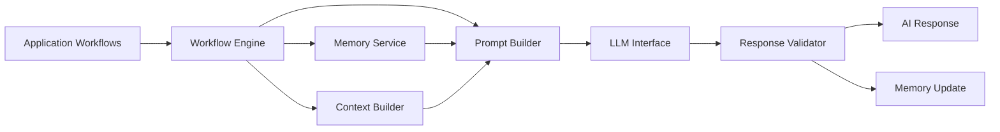
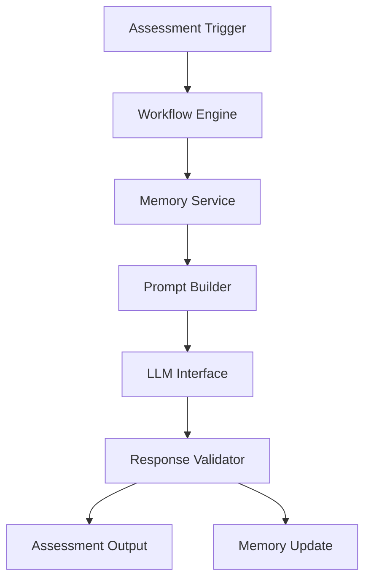
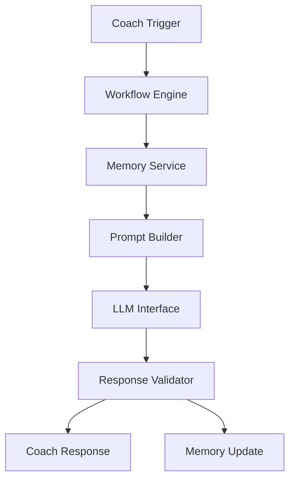
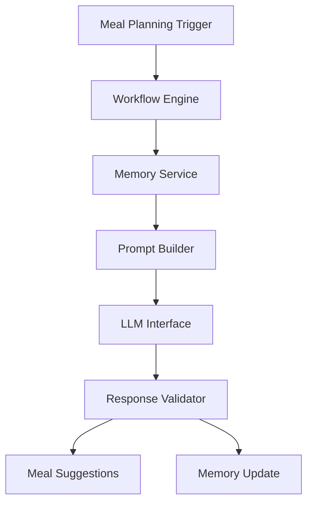
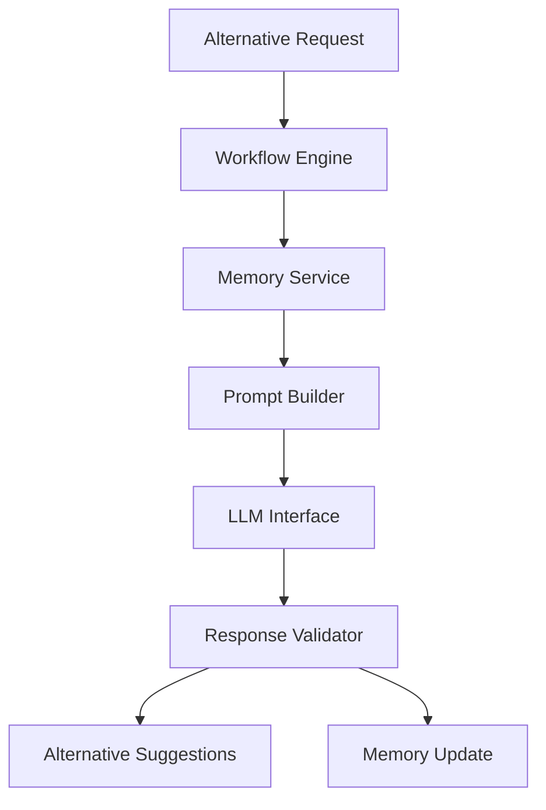
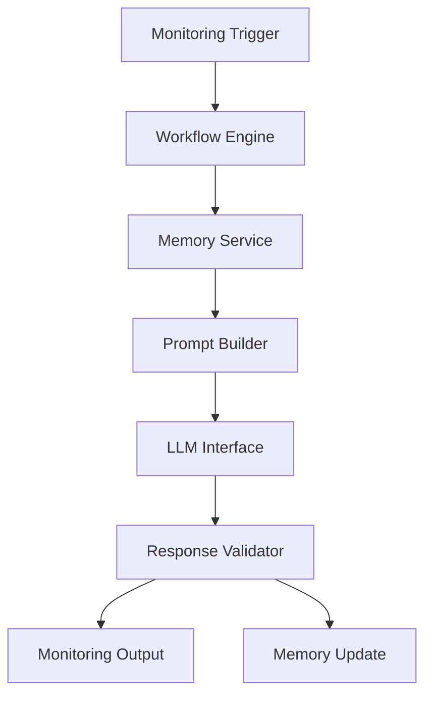
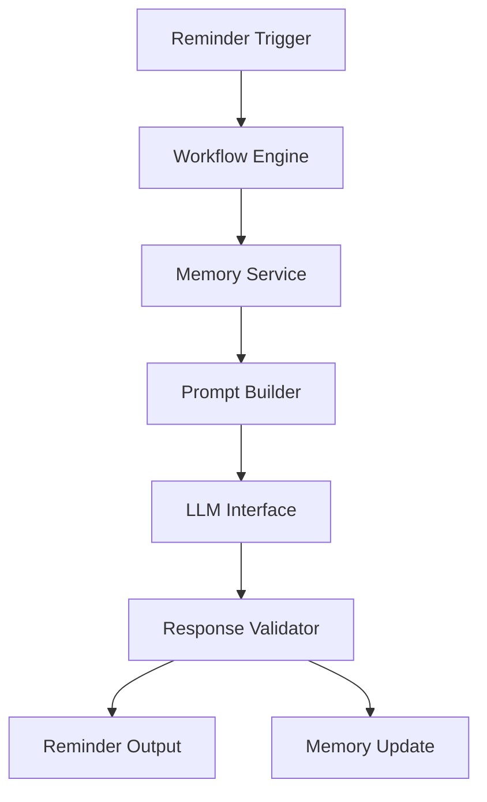
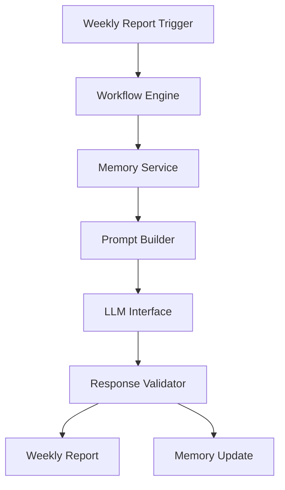
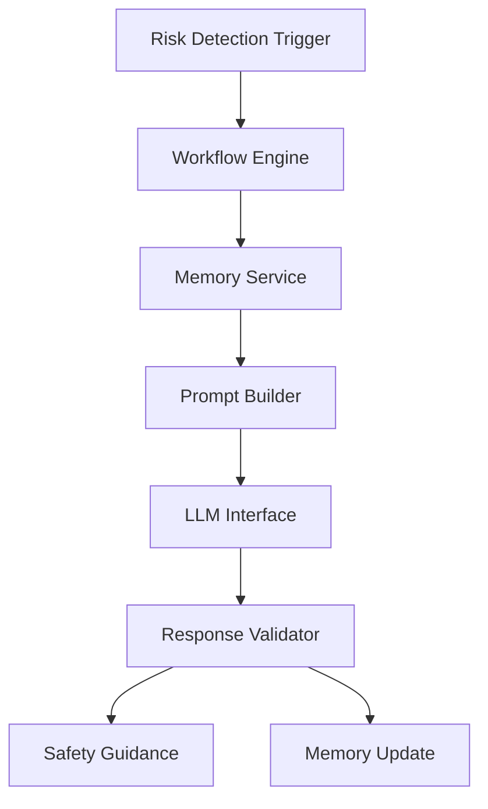
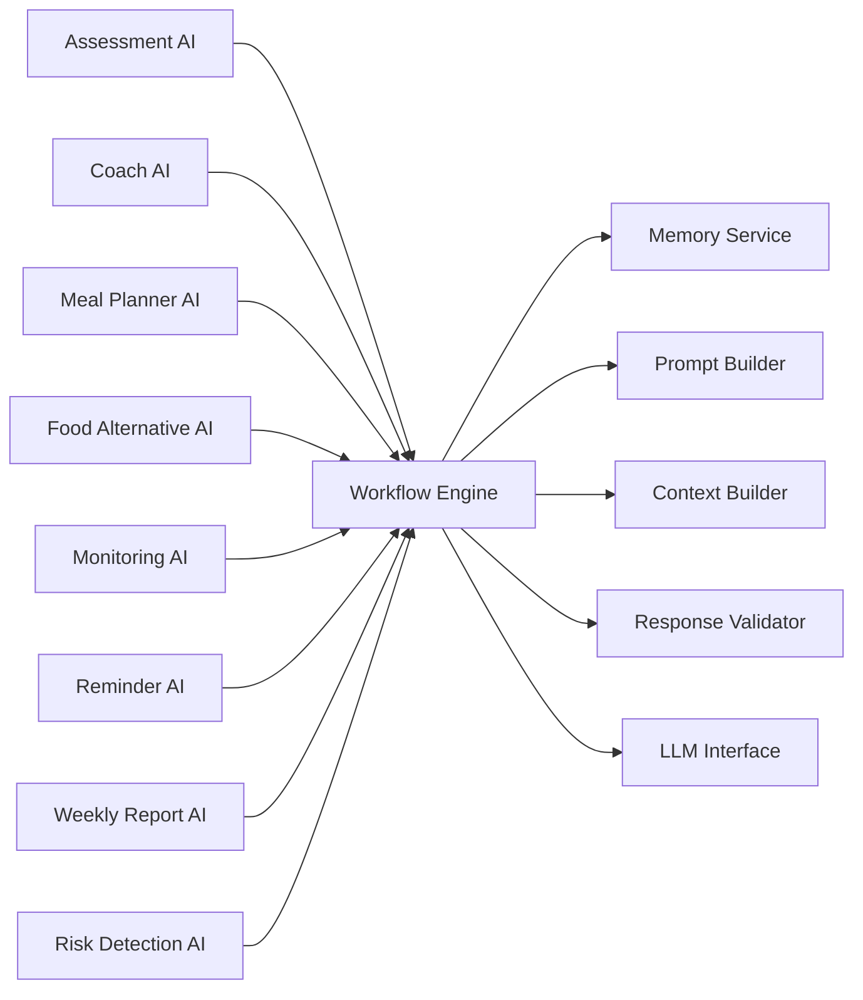

# HealthGuard v2.0 — AI Modules Architecture

**Document Type:** AI Module Specification
**Product:** HealthGuard — AI Lifestyle Companion for Diabetes Prevention
**Scope:** Defines the internal AI services and modules that compose the HealthGuard AI layer, in alignment with AI_WORKFLOW.md, AI_MEMORY.md, and AI_PROMPT.md.

This document extends AI_WORKFLOW.md, AI_MEMORY.md, and AI_PROMPT.md. It does not replace them.

---

## 1. Purpose

This document defines the internal AI module layer used by HealthGuard v2.0 to organize AI behavior into clear, reusable services.

The AI module layer exists to ensure that the product’s AI responsibilities are divided into well-defined components that support onboarding, coaching, meal planning, monitoring, reminders, reporting, and safety-oriented assessment. It provides a shared structure for workflow execution, memory access, prompt construction, response validation, and memory update.

The AI modules are responsible for delivering the product experience described in AI_WORKFLOW.md without duplicating logic across workflows.

---

## 2. AI Layer Overview

The AI layer sits between the application workflows and the underlying LLM interface. It receives workflow events from the application, gathers relevant memory and context, builds a prompt, sends it to the LLM, validates the result, and updates memory when appropriate.

The AI layer is not a standalone product feature. It is a supporting architecture that enables the workflows in HealthGuard to behave consistently and intentionally.

### Layer Responsibilities

- Application workflows trigger AI behavior through a shared workflow engine.
- The memory service provides relevant long-term and short-term memory.
- The context builder supplies temporary workflow-specific information.
- The prompt builder assembles the system, developer, user, memory, and context components.
- The LLM interface sends the assembled prompt to the underlying model layer.
- The response validator checks compliance with workflow, safety, and output requirements.
- Memory update persists only the relevant changes derived from the response.

---

## 3. Shared AI Components

The AI layer is composed of shared services that support all modules.

### Workflow Engine

**Responsibility:**
- Determine which workflow is active
- Route the interaction to the correct module
- Maintain the execution context for the current request

The workflow engine is the entry point for all AI-driven behavior. It ensures that each request follows the lifecycle and boundaries defined in AI_WORKFLOW.md.

### Memory Service

**Responsibility:**
- Retrieve relevant memory from long-term and short-term memory stores
- Apply memory priority and retention rules
- Return a filtered memory snapshot for the current task

The memory service is aligned with AI_MEMORY.md and ensures that memory access is consistent, intentional, and limited to the current workflow context.

### Prompt Builder

**Responsibility:**
- Assemble the system prompt, developer prompt, user prompt, memory injection, and context injection
- Construct a standard prompt structure for every workflow
- Keep prompting consistent across modules

The prompt builder is the shared orchestration point for prompt construction and is defined by AI_PROMPT.md.

### Context Builder

**Responsibility:**
- Prepare temporary workflow context such as the current meal slot, reminder state, conversation summary, or active goal
- Provide task-specific context without duplicating memory logic

### Response Validator

**Responsibility:**
- Confirm that the response matches the required workflow and output format
- Enforce safety rules
- Reject or revise responses that violate the AI principles

### LLM Interface

**Responsibility:**
- Send the assembled prompt to the underlying LLM layer
- Receive the model output
- Return the raw response for validation and downstream processing

The LLM interface is implementation-agnostic and does not define any vendor-specific behavior.

---

## 4. AI Modules

The HealthGuard AI layer contains the following modules.

---

### 4.1 Assessment AI

#### Purpose
To collect and interpret user-provided lifestyle information during onboarding and related assessment moments, producing a structured coaching understanding without medical diagnosis.

#### Responsibilities
- interpret onboarding responses
- generate a plain-language health persona summary
- produce initial coaching direction based on user responses
- preserve the distinction between lifestyle assessment and medical diagnosis

#### Trigger
- onboarding start
- first-time health profile completion
- user re-entry into assessment-related flow

#### Inputs
- health profile answers
- lifestyle preferences
- activity and sleep context
- user-stated goals

#### Memory Used
- Health Persona
- Goals
- Favorite Foods
- Lifestyle Preferences

#### Prompt Used
- onboarding-oriented developer prompt
- system prompt with safety boundaries
- relevant memory and context injection

#### Processing
1. Collect structured assessment data.
2. Build a workflow-specific prompt.
3. Generate a plain-language summary and initial coaching direction.
4. Validate the output for safety and workflow alignment.
5. Store or update relevant memory.

#### Outputs
- Health Persona summary
- initial goals
- coaching tone guidance
- onboarding context for future workflows

#### Dependencies
- Workflow Engine
- Memory Service
- Prompt Builder
- Context Builder
- Response Validator

#### Error Handling
- If required inputs are missing, the module uses defaults and continues without blocking the workflow.
- If the response contains medical judgment, it is rejected and reformulated as non-diagnostic coaching guidance.

#### Future Improvements
- richer onboarding preference extraction
- more structured assessment summaries for future personalization

---

### 4.2 Coach AI

#### Purpose
To provide day-to-day coaching support in a consistent, encouraging, and workflow-aligned manner.

#### Responsibilities
- greet and guide the user during daily interactions
- maintain tone and coaching continuity
- support the Daily Workflow
- keep recommendations gradual and non-diagnostic

#### Trigger
- daily workflow entry
- morning check-in
- user request for coaching guidance

#### Inputs
- current goals
- health persona
- recent progress
- current conversation context
- current date and time

#### Memory Used
- Health Persona
- Goals
- Current Week Summary
- Current Conversation Context
- Reminder Preferences

#### Prompt Used
- daily coaching developer prompt
- relevant memory and context injection

#### Processing
1. Retrieve the current coaching context.
2. Build a daily coaching prompt.
3. Generate a response that is supportive and actionable.
4. Validate the output for tone, safety, and workflow relevance.
5. Update memory if the interaction changes user preferences or progress context.

#### Outputs
- daily coaching message
- guidance for the next small step
- updated conversation context

#### Dependencies
- Workflow Engine
- Memory Service
- Prompt Builder
- Context Builder
- Response Validator

#### Error Handling
- If no current context is available, the module uses the existing health persona and goals to continue.
- If the response would be too prescriptive, it is revised to remain coaching-oriented.

#### Future Improvements
- richer adaptive coaching tones based on accumulated patterns

---

### 4.3 Meal Planner AI

#### Purpose
To generate meal suggestions that align with the user’s preferences, goals, and lifestyle persona within the Meal Planner Workflow.

#### Responsibilities
- generate meal suggestions for breakfast, lunch, dinner, and snack
- align meals with current goals and preferences
- avoid contradicting the health persona
- remain educational and non-clinical

#### Trigger
- daily meal plan generation
- manual meal suggestion request

#### Inputs
- favorite foods
- favorite drinks
- favorite snacks
- goals
- health persona
- current meal slot

#### Memory Used
- Favorite Foods
- Accepted Alternatives
- Rejected Alternatives
- Goals
- Health Persona

#### Prompt Used
- meal planner developer prompt
- memory and context injection for meal planning

#### Processing
1. Retrieve relevant meal-planning memory.
2. Build a meal-planning prompt.
3. Generate meal suggestions with short rationale.
4. Validate the output for appropriateness and safety.
5. Update memory if the user accepts or rejects the suggestions.

#### Outputs
- meal suggestions
- short rationale for each suggestion
- meal-planning context for later use

#### Dependencies
- Workflow Engine
- Memory Service
- Prompt Builder
- Context Builder
- Response Validator

#### Error Handling
- If preferences are insufficient, the module falls back to safe general guidance and asks the user to confirm.
- If alternatives would be inappropriate, they are not presented.

#### Future Improvements
- more structured meal suggestion explanations

---

### 4.4 Food Alternative AI

#### Purpose
To provide healthier substitute options when the user rejects a suggested menu item.

#### Responsibilities
- propose alternatives that preserve the meal’s role
- respect the user’s preferences and goals
- explain substitutions clearly and simply

#### Trigger
- user taps replace for a suggested menu item
- user requests an alternative recommendation

#### Inputs
- rejected food item
- favorite foods
- health persona
- current goals
- meal context

#### Memory Used
- Favorite Foods
- Rejected Alternatives
- Accepted Alternatives
- Goals
- Health Persona

#### Prompt Used
- food alternative developer prompt
- relevant memory and context injection

#### Processing
1. Identify the role of the rejected item in the meal.
2. Gather preference and goal context.
3. Generate alternative suggestions that fit the meal’s purpose.
4. Validate recommendations for workflow relevance and safety.
5. Record accepted or rejected alternatives in memory.

#### Outputs
- alternative food suggestions
- one-line explanation for each suggestion

#### Dependencies
- Workflow Engine
- Memory Service
- Prompt Builder
- Context Builder
- Response Validator

#### Error Handling
- If too few suitable alternatives exist, the module presents the best available options and remains transparent.
- If the response is not aligned with the meal role, it is rejected and regenerated.

#### Future Improvements
- more explicit substitution reasoning for recurring disliked items

---

### 4.5 Monitoring AI

#### Purpose
To interpret progress data from food, activity, water, and sleep tracking and support ongoing coaching review.

#### Responsibilities
- summarize recent progress
- support weekly review and trend awareness
- identify meaningful patterns without providing medical diagnosis

#### Trigger
- daily monitoring update
- weekly review preparation
- explicit progress review request

#### Inputs
- food logs
- activity logs
- water and sleep data
- current goals
- weekly progress context

#### Memory Used
- Weekly Progress
- Goals
- Health Persona
- Current Week Summary

#### Prompt Used
- monitoring-oriented developer prompt
- memory and context injection

#### Processing
1. Gather recent progress and tracking data.
2. Build a monitoring prompt with current weekly context.
3. Generate a concise progress summary or coaching review.
4. Validate the response for safety and relevance.
5. Update weekly progress memory if appropriate.

#### Outputs
- progress summary
- coaching observations
- weekly review context

#### Dependencies
- Workflow Engine
- Memory Service
- Prompt Builder
- Context Builder
- Response Validator

#### Error Handling
- If data is incomplete, the module reports the available information without inventing missing patterns.
- If the output would suggest medical judgment, it is rejected.

#### Future Improvements
- richer pattern summarization for weekly review

---

### 4.6 Reminder AI

#### Purpose
To support reminder generation and reminder personalization within the Daily Workflow and related coaching touchpoints.

#### Responsibilities
- create or adjust reminder messages
- personalize reminder timing and tone
- keep reminders aligned with the user’s current goal and persona

#### Trigger
- reminder creation
- daily reminder preparation
- user request to adjust reminder timing

#### Inputs
- reminder preferences
- current goal
- current time context
- conversation context

#### Memory Used
- Reminder Preferences
- Today's Reminder
- Current Conversation Context
- Goals

#### Prompt Used
- reminder developer prompt
- relevant memory and context injection

#### Processing
1. Retrieve reminder-related memory.
2. Build a reminder-focused prompt.
3. Generate a reminder message that fits the user’s style and goals.
4. Validate the output for appropriateness and clarity.
5. Update reminder-related memory if the user adjusts preferences.

#### Outputs
- reminder message
- reminder timing guidance
- reminder preference updates

#### Dependencies
- Workflow Engine
- Memory Service
- Prompt Builder
- Context Builder
- Response Validator

#### Error Handling
- If the reminder timing is missing, the module uses the last known preference or a default safe timing.
- If the output is too intrusive, it is revised to remain lightweight.

#### Future Improvements
- more adaptive reminder scheduling logic

---

### 4.7 Weekly Report AI

#### Purpose
To generate concise weekly summaries and coaching insights that reflect progress, achievements, and next-step recommendations.

#### Responsibilities
- summarize the week in a structured and supportive way
- identify areas for improvement and reinforcement
- prepare the weekly report for user review

#### Trigger
- end-of-week report generation
- weekly review request

#### Inputs
- weekly progress data
- goals
- recent activity and food logs
- health persona

#### Memory Used
- Weekly Progress
- Goals
- Health Persona
- Current Week Summary

#### Prompt Used
- weekly report developer prompt
- memory and context injection

#### Processing
1. Gather weekly data from the monitoring context.
2. Build the weekly report prompt.
3. Generate a concise report with achievements and suggestions.
4. Validate output for tone, clarity, and safety.
5. Store the report as the latest weekly summary.

#### Outputs
- weekly summary
- achievements
- improvement suggestions

#### Dependencies
- Workflow Engine
- Memory Service
- Prompt Builder
- Context Builder
- Response Validator

#### Error Handling
- If the available data is incomplete, the report reflects only what is known and does not invent missing progress.
- If the output contains medical wording, it is rewritten into coaching language.

#### Future Improvements
- more detailed trend interpretation over multiple weeks

---

### 4.8 Risk Detection AI

#### Purpose
To identify situations that may require safe, non-diagnostic coaching attention, especially when user behavior suggests elevated concern or a need to redirect toward a healthcare professional.

#### Responsibilities
- detect situations that require gentle escalation or caution
- preserve the boundary between coaching and diagnosis
- ensure the AI responds safely when a medical concern appears

#### Trigger
- monitoring data review
- onboarding assessment review
- recurring patterns that suggest a need for caution

#### Inputs
- user-reported health context
- monitoring data patterns
- current workflow context
- safety guidance rules

#### Memory Used
- Health Persona
- Goals
- Current Week Summary
- weekly progress context

#### Prompt Used
- risk detection developer prompt
- safety-focused system and developer instructions

#### Processing
1. Review the available context for patterns that require caution.
2. Build a safety-focused prompt.
3. Determine whether the interaction should remain in coaching mode or require a non-diagnostic redirect.
4. Validate the output for safety and appropriateness.
5. Return a cautious response or escalation guidance without diagnosis.

#### Outputs
- safety guidance
- non-diagnostic coaching response
- redirected recommendation toward a healthcare professional when appropriate

#### Dependencies
- Workflow Engine
- Memory Service
- Prompt Builder
- Context Builder
- Response Validator

#### Error Handling
- If the evidence is insufficient, the module avoids making unsupported claims.
- If a medical concern is detected, the module redirects carefully and does not diagnose.

#### Future Improvements
- broader safety classification for additional health-related scenarios

---

## 5. Module Interaction

The AI modules do not call each other directly. Instead, they interact through shared services such as the workflow engine, memory service, prompt builder, context builder, response validator, and LLM interface.

This design keeps the modules loosely coupled and ensures that the same logic is reused across all AI workflows.

This architecture ensures that each module can focus on its workflow responsibilities while relying on shared infrastructure for memory, prompt construction, and validation.

---

## 6. Design Principles

The AI module layer follows a set of architectural principles that keep it consistent and maintainable.

### Single Responsibility
Each module is responsible for a specific workflow domain and does not take on unrelated AI concerns.

### Loose Coupling
Modules interact through shared services rather than direct dependencies on each other.

### Reusable Prompt Builder
All modules share the prompt construction process defined by AI_PROMPT.md.

### Shared Memory Service
Memory access follows one consistent service layer described in AI_MEMORY.md.

### Centralized Response Validation
All AI outputs pass through the same validation process before they are used by the application.

### Workflow-driven Execution
Modules execute only when triggered by a defined workflow from AI_WORKFLOW.md.

---

## 7. Future Improvements

The following architectural ideas may be considered in later phases but are not part of the MVP 2.0 scope:

- expanded module specialization for additional lifestyle workflows
- richer orchestration between monitoring and coaching modules
- additional reusable prompt variants for new workflow types
- more advanced shared caching and context reuse strategies

These improvements are documented for future planning only and do not alter the current AI module architecture.
