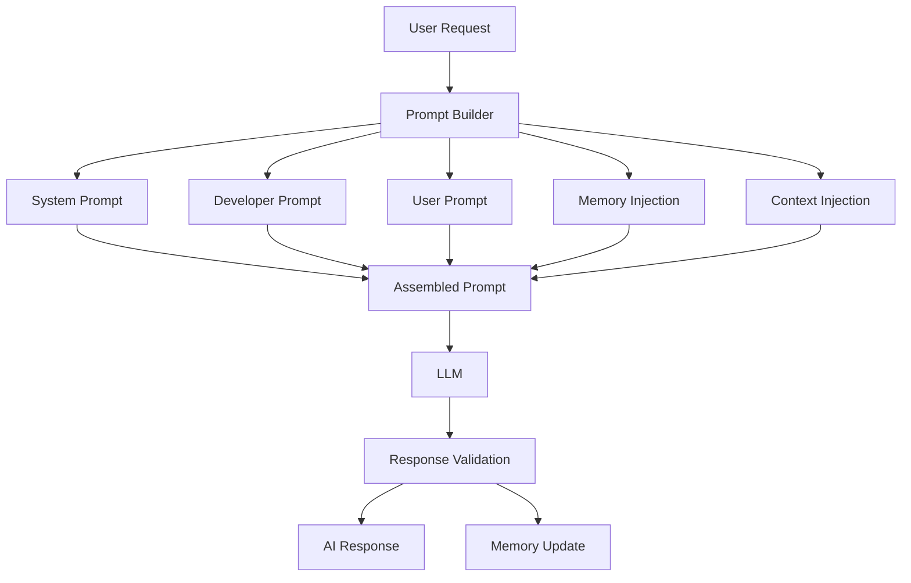
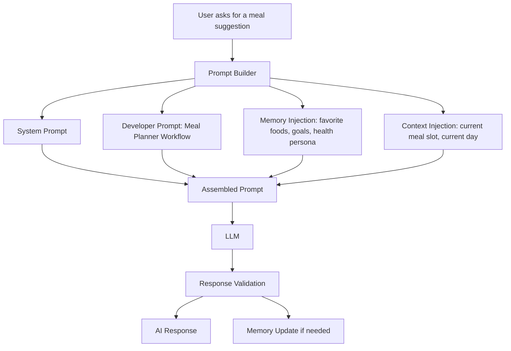

# HealthGuard v2.0 — AI Prompt Architecture

**Document Type:** AI Prompt Specification
**Product:** HealthGuard — AI Lifestyle Companion for Diabetes Prevention
**Scope:** Defines how prompts are constructed, assembled, and validated before being sent to the LLM, in alignment with the workflows documented in AI_WORKFLOW.md and the memory model defined in AI_MEMORY.md.

This document extends AI_WORKFLOW.md and AI_MEMORY.md. It does not replace either document.

---

## 1. Purpose

This document defines the prompt architecture used by HealthGuard v2.0 to ensure that every AI interaction is consistent, safe, purpose-driven, and aligned with the product’s coaching model.

Its purpose is to describe how the system transforms a user request into a structured prompt, injects relevant memory and context, sends the request to the LLM, validates the response, and updates memory when appropriate.

The prompt architecture exists to support the following goals:
- maintain consistency across all AI workflows
- preserve the HealthGuard AI principles
- keep prompts grounded in the current workflow and user memory
- avoid unsupported medical claims or unsafe behavior
- ensure responses remain appropriate for a lifestyle companion, not a medical advisor

---

## 2. Prompt Philosophy

HealthGuard prompts are designed to be:
- workflow-driven
- memory-aware
- context-aware
- safety-first
- implementation-agnostic

The AI does not operate as a general-purpose chatbot. It acts as a coaching assistant within the defined workflows of HealthGuard. Every prompt must therefore reflect the active workflow, the user’s current needs, the available memory, and the safety boundaries of the product.

Prompts must never:
- diagnose disease
- prescribe medication or treatment
- present medical judgment as fact
- contradict the documented coaching principles

---

## 3. Prompt Pipeline

The prompt lifecycle begins with a user request and concludes with a validated response and any required memory update.



### Pipeline Stages

1. User Request Intake
   - The user initiates an interaction through a defined workflow, such as onboarding, daily coaching, meal planning, or reminder handling.

2. Prompt Builder
   - The prompt builder assembles the final prompt from reusable prompt components.

3. Prompt Assembly
   - The system prompt, developer prompt, user prompt, memory injection, and context injection are combined into a single request.

4. LLM Processing
   - The LLM generates a response based on the assembled prompt.

5. Response Validation
   - The response is checked for safety, format, workflow consistency, and alignment with HealthGuard principles.

6. Memory Update
   - If the response changes or confirms user preferences, behavior, or goals, the relevant memory is updated according to AI_MEMORY.md.

---

## 4. Prompt Components

Every prompt is composed of several distinct components. These components are conceptually separate even when assembled into one final request.

### System Prompt
The system prompt establishes the overall role and guardrails of the AI. It defines the AI as a HealthGuard lifestyle companion and sets boundaries around medical safety and coaching behavior.

### Developer Prompt
The developer prompt defines the specific workflow context and task instructions. It tells the AI what workflow is active, what the expected behavior is, and how the response should be structured.

### User Prompt
The user prompt reflects the actual request from the user in their own words. It captures the immediate intent of the interaction.

### Memory Injection
Memory injection provides relevant long-term and short-term memory from AI_MEMORY.md. It enhances personalization without overwhelming the prompt.

### Context Injection
Context injection provides temporary information such as the active workflow step, recent progress, current meal plan, reminder state, or conversation history relevant to the current moment.

---

## 5. System Prompt

The system prompt is the foundational instruction layer. It defines the AI’s role, scope, and non-negotiable constraints.

It should establish that:
- HealthGuard is an AI Lifestyle Companion
- the AI supports gradual lifestyle improvement
- the AI does not diagnose disease
- the AI does not prescribe medication or treatment
- the AI should redirect medical concerns to a healthcare professional
- the AI should remain aligned with the current workflow

The system prompt should not include implementation details or vendor-specific behavior. It should remain stable across the product.

---

## 6. Developer Prompt

The developer prompt supplies workflow-specific instructions.

It should specify:
- which workflow is active
- what the AI is expected to accomplish
- what information should be considered
- what output format is expected
- what constraints apply to the current task

Examples of workflow-specific intent include:
- onboarding guidance
- daily check-in support
- meal planning support
- food alternative generation
- reminder assistance
- progress review support

The developer prompt is responsible for keeping the AI within the boundaries of the current workflow defined in AI_WORKFLOW.md.

---

## 7. User Prompt

The user prompt contains the immediate request made by the user.

It may include:
- a direct request such as a meal suggestion
- a preference change
- a reminder request
- a reply to a coaching prompt
- a question about progress or plan

The user prompt should remain as close to the user’s actual language as possible while still being clear and structured for the AI.

---

## 8. Memory Injection

Memory injection is the selective insertion of relevant memories from AI_MEMORY.md into the prompt.

It should include only the memory categories that are relevant to the active workflow and current user task.

Examples of memory that may be injected:
- Health Persona
- Goals
- Favorite Foods
- Current Week Summary
- Current Meal Plan
- Reminder Preferences

Memory injection must respect the memory priority rules defined in AI_MEMORY.md and should avoid unnecessary historical detail.

The memory injection layer is responsible for making the prompt personalized without making it overly long or irrelevant.

---

## 9. Context Injection

Context injection provides short-lived working context required for the current interaction.

Examples include:
- current workflow step
- current date or time
- current meal slot
- user’s recent food checklist status
- current reminder state
- recent conversation summary

Unlike memory injection, context injection is temporary and workflow-specific. It supports the immediate request rather than long-term personalization.

---

## 10. Prompt Template

Every AI workflow should use a standard prompt structure. The structure is conceptual and implementation-agnostic.

### Standard Prompt Template

1. System Prompt
2. Developer Prompt
3. Relevant Memory Injection
4. Relevant Context Injection
5. User Prompt
6. Expected Output Format
7. Safety Rules

This template ensures that each interaction begins with stable role definition, workflow-specific instructions, relevant personalization, and a clear request.

### Template Intent

The template is not meant to be rigid in wording, but it should remain consistent in structure and purpose. The same core sequence should be followed for onboarding, daily coaching, meal planning, reminder handling, and other defined workflows.

---

## 11. Output Format

The LLM should return a structured response that is easy to validate and use by the application.

A standard JSON output structure should include:
- workflow
- response_type
- message
- recommendations
- memory_updates
- safety_notes

### Conceptual Output Example

```json
{
  "workflow": "meal_planner",
  "response_type": "suggestion",
  "message": "A concise coaching response for the user",
  "recommendations": [],
  "memory_updates": [],
  "safety_notes": []
}
```

This format provides a consistent envelope for the AI response while still allowing the content to vary by workflow.

The output should be validated for:
- required fields
- acceptable workflow type
- safe language
- absence of unsupported medical claims
- alignment with the active workflow

---

## 12. Prompt Safety Rules

The prompt architecture must enforce the HealthGuard AI principles at all times.

The following safety rules apply:
- The AI must never diagnose disease.
- The AI must never prescribe medication or treatment.
- The AI must never present medical advice as a diagnosis.
- The AI must frame guidance as gradual lifestyle improvement.
- The AI must redirect medical concerns to a healthcare professional.
- The AI must not contradict the workflow defined in AI_WORKFLOW.md.
- The AI must not invent memories beyond what is supported by AI_MEMORY.md.
- The AI must avoid unsupported claims or overly confident medical statements.
- The AI must remain within the role of lifestyle companion and coaching support.

These rules should be present in the system prompt and reinforced within the developer prompt and response validation process.

---

## 13. Example Prompt Flow

The following example illustrates the full prompt lifecycle for a meal-planning interaction.



In this example, the prompt includes role instructions, workflow context, relevant memory, current context, and the user request. The output is then validated and used to produce the response or update memory.

---

## 14. Future Improvements

The following are future-facing ideas and are documented only for awareness. They do not alter the MVP 2.0 design.

- richer workflow-specific prompt templates
- more granular response validation rules
- expanded prompt routing for additional conversational scenarios
- additional memory-aware prompt tuning

These future improvements should remain optional and should not be introduced into the MVP without additional design review.
