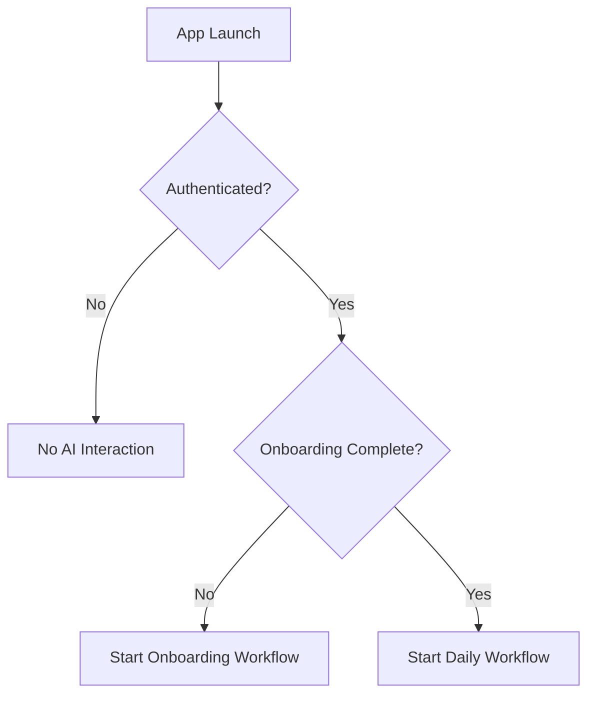
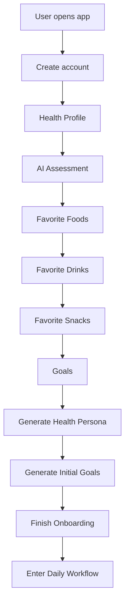
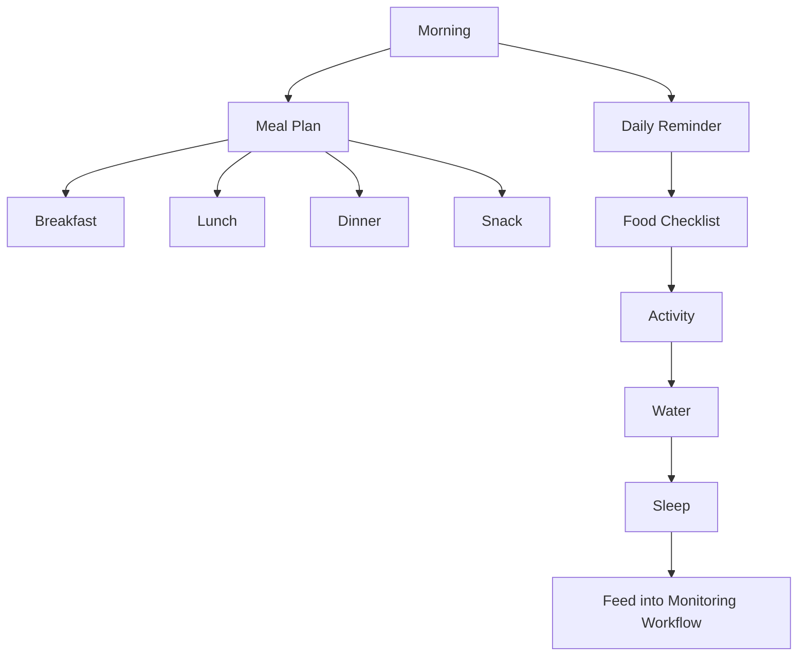
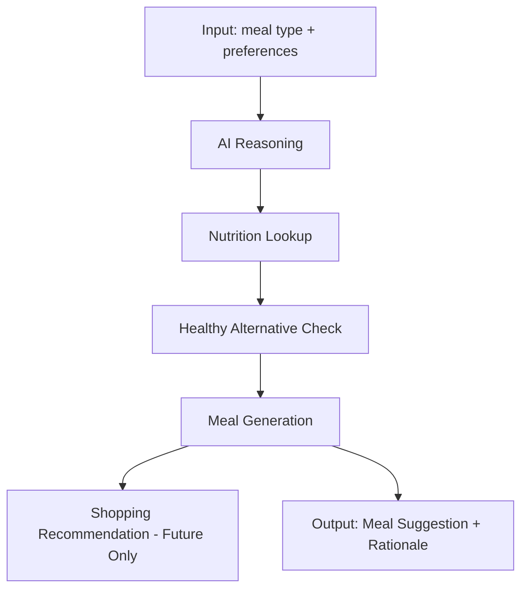
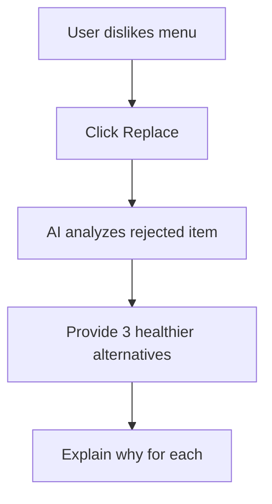
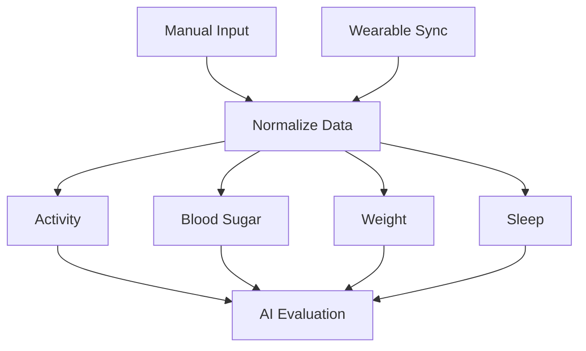
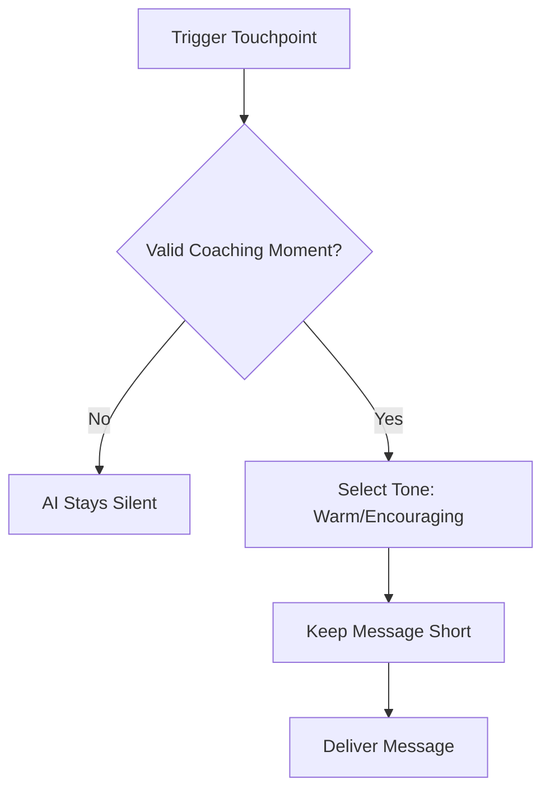
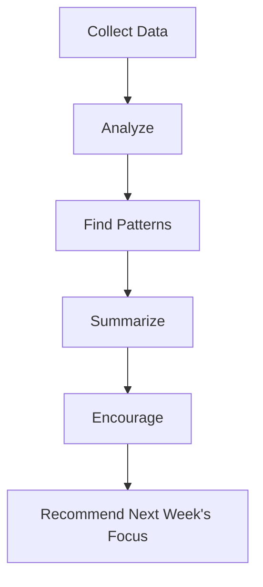
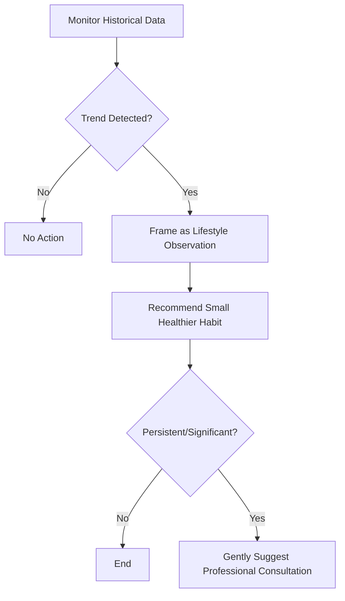
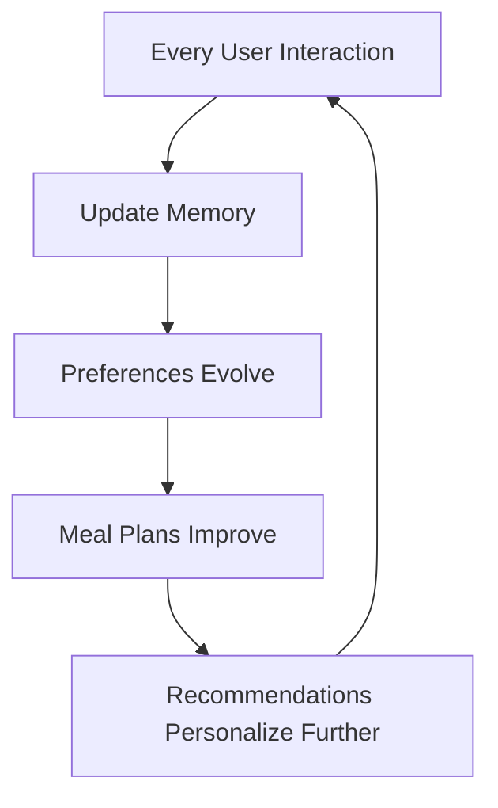

# HealthGuard v2.0 — AI Workflow Documentation

**Document Type:** AI Workflow Specification (Single Source of Truth)
**Product:** HealthGuard — AI Lifestyle Companion for Diabetes Prevention
**Scope:** Describes every AI interaction from first app open through long-term daily usage.

## Core AI Principles (apply to every workflow below)

- HealthGuard is a **lifestyle companion**, not a chatbot.
- The AI **never diagnoses** disease.
- The AI **never prescribes** medicine, dosages, or medical treatment.
- The AI **always** frames guidance as **gradual lifestyle improvement**.
- The AI **remembers** prior conversations, preferences, and history to personalize coaching.
- Any output resembling a medical judgment must be redirected to "consult a healthcare professional" language.

---

## 1. AI Entry Point

### Purpose
Define the exact moment the AI begins interacting with the user, so no AI behavior occurs outside a defined trigger.

### Trigger
First app launch, immediately after account creation is confirmed (not before — the AI does not interact with anonymous/unauthenticated users).

### Inputs
- Authenticated user ID
- Device/app locale
- Timestamp of first launch

### Processing
- System initializes an empty AI Memory profile for the user.
- AI determines the user is "new" (no Health Profile exists yet) and routes into the Onboarding Workflow (Section 2).
- On all future launches, AI checks whether onboarding is complete; if yes, routes into Daily Workflow (Section 3).

### Outputs
- Session state: `new_user` or `returning_user`
- Redirect into Onboarding Workflow or Daily Workflow

### AI Memory Used
- None yet (memory profile created here, empty)

### Fallback
- If account creation fails or user ID is missing, AI does not initiate — app shows standard account error, no AI dialogue.

### Future Improvements
- Multi-device entry point synchronization (not in MVP 2.0 scope; noted only, not designed here).

---

## 2. Onboarding Workflow

### Purpose
Collect the minimum information required for the AI to build an initial Health Persona and initial goals, entirely through guided conversation steps.

### Trigger
`new_user` session state from Section 1.

### Inputs
- Account details (from account creation)
- Health Profile answers (age, height, weight, existing lifestyle conditions the user chooses to share — self-reported only, no clinical data entry)
- AI Assessment responses (lifestyle habits, activity level, sleep patterns, stress indicators — self-reported)
- Favorite Foods list
- Favorite Drinks list
- Favorite Snacks list
- User-stated Goals (e.g., "eat healthier," "move more," "sleep better")

### Processing
Each step below is a discrete AI-guided conversation turn. The AI asks, listens, confirms, and stores — one step at a time, never combining steps.

1. **Create account** → handled by app, AI is silent until confirmed.
2. **Health Profile** → AI asks structured, non-diagnostic questions (age, height, weight, general activity habits).
3. **AI Assessment** → AI synthesizes Health Profile answers into a plain-language lifestyle summary (never a diagnosis, never a risk score presented as medical).
4. **Favorite Foods / Drinks / Snacks** → AI collects preference lists conversationally, one category at a time.
5. **Goals** → AI asks the user to select or state personal goals in their own words.
6. **Generate Health Persona** → AI compiles a lifestyle "persona" (e.g., "Busy Professional, Moderate Activity, Prefers Home-Cooked Meals") used to tailor tone and recommendations.
7. **Generate Initial Goals** → AI translates user goals into 2–3 small, gradual, trackable starting goals (e.g., "add one vegetable serving per day").
8. **Finish onboarding** → AI confirms persona and goals with the user, stores them, and hands off to Daily Workflow.

### Outputs
- Stored Health Profile
- Stored Favorite Foods/Drinks/Snacks
- Generated Health Persona
- Generated Initial Goals (small, gradual, non-clinical)

### AI Memory Used
- None consumed (this workflow is what creates the memory baseline)

### Fallback
- If user skips a step (e.g., no favorite snacks provided), AI proceeds with defaults and a note that preferences can be added later — onboarding never blocks on optional data.
- If AI Assessment responses suggest a medical concern, AI responds with a gentle, non-diagnostic note recommending the user speak with a healthcare professional, and continues onboarding.

### Future Improvements
- Optional import of preferences from external apps (not in MVP 2.0).

---

## 3. Daily Workflow

### Purpose
Define the recurring daily structure through which the AI engages the user once onboarding is complete.

### Trigger
App open by a `returning_user`, or scheduled daily check-in time.

### Inputs
- Stored Health Persona
- Stored Goals
- Prior day's monitoring data (Section 6)
- Current date/time of day

### Processing
1. **Morning** — AI greets user, briefly reviews yesterday, sets tone for the day.
2. **Meal Plan** — AI presents Breakfast, Lunch, Dinner, and Snack suggestions (see Section 4 for generation logic).
3. **Daily Reminder** — AI issues a lightweight nudge tied to the user's current small goal.
4. **Food Checklist** — AI tracks which planned meals were logged as eaten/skipped/replaced.
5. **Activity** — AI prompts for or receives activity data.
6. **Water** — AI prompts for or receives hydration data.
7. **Sleep** — AI prompts for or receives prior-night sleep data (usually reviewed in the following morning cycle).

### Outputs
- Daily meal plan
- Daily reminder message
- Updated food checklist
- Logged activity/water/sleep entries queued for Monitoring Workflow

### AI Memory Used
- Health Persona
- Favorite Foods/Drinks/Snacks
- Current goals
- Recent logging history (last few days, for continuity of tone)

### Fallback
- If user does not respond to morning check-in, AI does not escalate frequency — it simply carries the plan forward silently and re-engages at the next natural touchpoint.

### Future Improvements
- Adaptive reminder timing based on user's typical active hours (not in MVP 2.0).

---

## 4. Meal Planner Workflow

### Purpose
Generate meal suggestions aligned with the user's preferences, goals, and lifestyle persona.

### Trigger
Daily Workflow's Meal Plan step, or manual user request ("suggest a meal").

### Inputs
- Favorite Foods/Drinks/Snacks
- Health Persona
- Current goals
- Time of day (meal type)

### Processing
1. **Input** — AI gathers meal type, preferences, and any recent dislikes/replacements.
2. **AI reasoning** — AI weighs preferences against current goals (e.g., "add more vegetables" goal influences meal composition).
3. **Nutrition lookup** — AI references general nutrition information for candidate foods (educational, not clinical).
4. **Healthy alternative** — AI substitutes less healthy preferred items with closer, more balanced options where relevant.
5. **Meal generation** — AI assembles a specific meal suggestion (e.g., "Grilled chicken, brown rice, steamed broccoli").
6. **Shopping recommendation (future only)** — placeholder step, not implemented in MVP 2.0; noted structurally for future roadmap only.
7. **Output** — AI presents the final meal suggestion with a short, plain-language reason.

### Outputs
- One meal suggestion per meal slot (Breakfast/Lunch/Dinner/Snack)
- Short rationale for each suggestion

### AI Memory Used
- Favorite Foods/Drinks/Snacks
- Past accepted/rejected meals
- Current goals

### Fallback
- If no preference data is available for a meal type, AI offers a general balanced default and asks the user to confirm or adjust.

### Future Improvements
- Shopping list / grocery recommendation generation (explicitly future-only, not built in MVP 2.0).

---

## 5. Food Alternative Workflow

### Purpose
Let the user request a replacement for a suggested menu item they dislike, without breaking the overall meal plan's balance.

### Trigger
User taps "Replace" on a suggested meal item.

### Inputs
- Rejected menu item
- Favorite Foods/Drinks/Snacks
- Health Persona
- Current goals

### Processing
1. **User dislikes menu** — user signals rejection.
2. **Click Replace** — action captured by app, sent to AI.
3. **AI analyzes** — AI reviews rejected item's nutritional role in the plan (e.g., protein source) and cross-references preferences.
4. **Provide 3 healthier alternatives** — AI returns exactly three substitute options that fill the same role in the meal.
5. **Explain why** — AI gives a one-line, plain-language reason per alternative (e.g., "similar protein, less saturated fat").

### Outputs
- Three alternative food items
- Short explanation per item

### AI Memory Used
- Favorite Foods/Drinks/Snacks
- Past replacement choices (to avoid repeating disliked suggestions)

### Fallback
- If fewer than three suitable alternatives exist, AI presents as many as available and is transparent about the limitation rather than inventing options.

### Future Improvements
- Learning to auto-avoid previously rejected foods in future plans without being asked again (partially covered in Section 10, not fully built in MVP 2.0).

---

## 6. Monitoring Workflow

### Purpose
Capture the user's real-world lifestyle data, either manually or via wearable sync, and produce an AI evaluation used across other workflows.

### Trigger
User manual entry, or scheduled/automatic wearable sync.

### Inputs
- Manual input: activity, blood sugar, weight, sleep (self-reported)
- Wearable Sync: same categories, device-sourced

### Processing
1. **Manual input or Wearable Sync** — data enters through either path, normalized to the same internal format.
2. **Activity** — steps/exercise minutes logged.
3. **Blood Sugar** — self-reported readings logged (AI treats these as lifestyle data points only, never as diagnostic values).
4. **Weight** — logged for trend tracking, not judgment.
5. **Sleep** — hours/quality logged.
6. **AI Evaluation** — AI reviews the combined entries against the user's recent history and goals, producing a short, encouraging, non-clinical observation.

### Outputs
- Normalized log entries (activity, blood sugar, weight, sleep)
- Short AI evaluation message

### AI Memory Used
- Historical logs (rolling window)
- Current goals

### Fallback
- If wearable sync fails, AI prompts for manual entry instead of blocking the workflow.
- If a data point is missing, AI evaluates on available data only and does not guess missing values.

### Future Improvements
- Broader wearable device support beyond MVP 2.0's initial integrations.

---

## 7. AI Coach Workflow

### Purpose
Define the voice, cadence, and boundaries of the AI's coaching persona so all AI-generated text is consistent across the product.

### Trigger
Any point the AI produces user-facing text: reminders, evaluations, reports, replacements.

### Inputs
- Health Persona
- Current context (which workflow triggered the message)
- Recent interaction history (to avoid repetitive phrasing)

### Processing
**When AI speaks:**
- At defined touchpoints only (morning check-in, meal plan delivery, reminder, evaluation, weekly report). Never unsolicited outside these touchpoints.

**How often:**
- At most once per touchpoint per day; no repeated nagging if the user is unresponsive.

**Tone:**
- Warm, encouraging, non-judgmental, plain-language. Never alarmist. Never clinical-sounding.

**Length:**
- Short. One to three sentences for reminders/evaluations; slightly longer only for the Weekly Report summary.

**Examples:**
- Reminder: "Small step today — a short walk after lunch could feel great."
- Evaluation: "Your sleep has been a bit shorter this week. Even 30 extra minutes can help."
- Replacement rationale: "Grilled fish has similar protein with less saturated fat than the fried option."

### Outputs
- Consistent AI voice applied across all other workflows

### AI Memory Used
- Health Persona
- Prior phrasing (to vary language and avoid repetition)

### Fallback
- If context is ambiguous or data is incomplete, AI defaults to general encouragement rather than specific claims.

### Future Improvements
- Tone personalization sliders (e.g., "more direct" vs "more gentle") — not in MVP 2.0.

---

## 8. Weekly Report Workflow

### Purpose
Summarize a week of user data into an encouraging, actionable overview.

### Trigger
Scheduled weekly interval (e.g., every 7 days from onboarding completion).

### Inputs
- One week of Monitoring Workflow data (activity, blood sugar, weight, sleep)
- Food Checklist history
- Current goals

### Processing
1. **Collect data** — AI gathers the week's logged entries.
2. **Analyze** — AI computes simple trends (averages, consistency, goal adherence).
3. **Find patterns** — AI identifies recurring behaviors (e.g., "activity dips on weekends").
4. **Summarize** — AI writes a short, plain-language weekly summary.
5. **Encourage** — AI highlights genuine positives, however small.
6. **Recommend next week's focus** — AI proposes one small, gradual focus area for the coming week.

### Outputs
- Weekly summary text
- One recommended focus area for next week

### AI Memory Used
- Full week of monitoring data
- Prior weekly reports (to track long-term trend continuity)
- Current goals

### Fallback
- If a week has insufficient data, AI reports partial results transparently and encourages more consistent logging rather than fabricating trends.

### Future Improvements
- Visual trend charts embedded directly in the report (UI feature, not part of this AI workflow document).

---

## 9. Risk Detection Workflow

### Purpose
Identify unhealthy lifestyle trends early and respond with supportive, non-diagnostic guidance — never a medical judgment.

### Trigger
Pattern thresholds detected during Monitoring Workflow or Weekly Report analysis (e.g., repeated entries over several days/weeks).

### Inputs
- Historical monitoring data (blood sugar, sleep, activity, weight)

### Processing
AI watches for trend patterns such as:
- Repeated high sugar readings (self-reported)
- Poor sleep over multiple consecutive nights
- Low activity over an extended period
- Weight gain trend over several weeks

**What happens when detected:**
- AI never states or implies a diagnosis (e.g., never says "you may have diabetes" or similar).
- AI frames the pattern purely as a lifestyle observation: "I've noticed your activity has been lower than usual this week."
- AI recommends a small, gradual healthier habit tied to the observed pattern.
- If the pattern is significant or persistent, AI includes a gentle suggestion to consult a healthcare professional — framed as general good practice, not as a response to a suspected condition.

### Outputs
- Non-diagnostic trend observation message
- One small recommended habit adjustment
- Optional gentle suggestion to consult a professional (for persistent/significant patterns only)

### AI Memory Used
- Multi-week historical trend data

### Fallback
- If data is too sparse to confirm a trend, AI does not raise a risk observation — it waits for more consistent data rather than acting on noise.

### Future Improvements
- More granular trend sensitivity tuning per user (not in MVP 2.0).

---

## 10. Long-Term Learning Workflow

### Purpose
Describe how the AI's coaching becomes more personalized and accurate the longer a user engages with HealthGuard.

### Trigger
Continuous — updated after every relevant interaction (meal choices, replacements, monitoring entries, weekly reports).

### Inputs
- All prior workflow outputs and user responses over time

### Processing
**What user data is remembered:**
- Health Persona and its updates
- Favorite/disliked foods, drinks, snacks (including replacement choices from Section 5)
- Goal history and progress
- Monitoring trend history
- Weekly report history

**How preferences evolve:**
- Each accepted or rejected meal/replacement adjusts the weight given to similar future suggestions.
- Repeated rejections of a food category reduce its future suggestion frequency.

**How meal plans improve:**
- Meal Planner Workflow (Section 4) draws on an increasingly accurate preference set, reducing the number of replacements needed over time.

**How recommendations become more personalized:**
- Daily Reminders and Weekly Report focus areas are chosen based on which past recommendations the user actually acted on, favoring habit types with higher past adherence.

### Outputs
- Continuously updated Health Persona
- Continuously refined preference and goal models
- Progressively more accurate meal suggestions and reminders

### AI Memory Used
- Full historical record across all prior workflows (Sections 2–9)

### Fallback
- If historical data is limited (new or infrequent user), AI relies more heavily on the original onboarding persona and gradually shifts weight to observed behavior as data accumulates.

### Future Improvements
- Explicit user-facing "preference summary" the user can review and edit directly (not in MVP 2.0).

---

## Document Status

This document reflects the HealthGuard MVP 2.0 specification only. No features, workflows, or data points beyond what is described above should be assumed or implemented. Any AI prompt or module built for HealthGuard must trace back to a section in this document.
