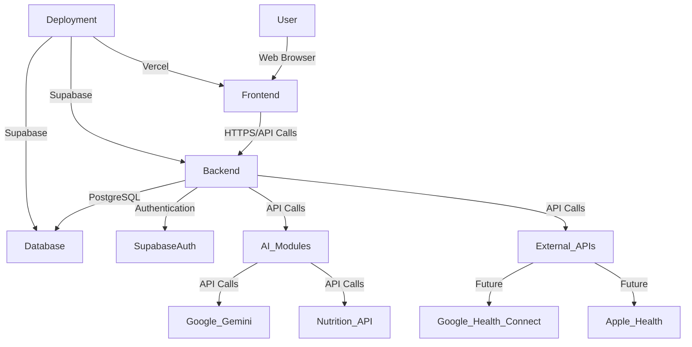

# System Architecture

## 1. Overview

HealthGuard v2.0 employs a modern, scalable, and maintainable architecture designed to support rapid iteration and an AI-first approach. The system is divided into distinct layers: Frontend, Backend, Database, Authentication, AI, and External APIs, all deployed on Vercel and Supabase.

## 2. Frontend

- **Technology:** Next.js 15, React 19, TypeScript, TailwindCSS, shadcn/ui, Framer Motion, React Hook Form, Zod, Lucide React.
- **Architecture:** App Router, Server Components (by default), Server Actions (wherever possible).
- **Responsibilities:** User interface rendering, client-side interactivity, data fetching (via Server Components/Actions), form handling, and navigation.
- **Folder Responsibilities:**
    - `app/`: Contains all route-specific files, layouts, and pages for the Next.js App Router.
    - `components/`: Houses reusable UI components that are general across the application.
    - `features/`: Each subdirectory within `features/` represents a self-contained feature, encapsulating its own components, hooks, services, and types to ensure modularity and isolation.
    - `hooks/`: Custom React hooks for encapsulating reusable logic.
    - `providers/`: Context providers for managing global state.
    - `styles/`: Global CSS and TailwindCSS configuration.
    - `public/`: Static assets like images and fonts.

## 3. Backend

- **Technology:** Supabase (PostgreSQL, Edge Functions).
- **Architecture:** Serverless functions (Edge Functions) for specific backend logic, leveraging PostgreSQL for database operations.
- **Responsibilities:** API endpoint management, data processing, business logic execution, interaction with AI modules and external APIs, and secure data storage.
- **Folder Responsibilities:**
    - `services/`: Contains business logic and data access layers, interacting with Supabase and external APIs.
    - `lib/api`: General API utility functions.
    - `supabase/`: Supabase client initialization and database configuration files.

## 4. Database

- **Technology:** PostgreSQL (managed by Supabase).
- **Responsibilities:** Persisting all application data, including user profiles, health data, meal plans, and AI insights. Handles data relationships, integrity, and scalability.

## 5. Authentication

- **Technology:** Supabase Auth.
- **Responsibilities:** User registration, login, session management, and authorization. Provides secure and scalable authentication services.
- **Folder Responsibilities:**
    - `lib/auth`: Contains authentication-related utility functions and helpers for integrating with Supabase Auth.

## 6. AI

- **Technology:** Google Gemini API, Nutrition API.
- **Responsibilities:** Core intelligence of HealthGuard, including lifestyle understanding, meal planning, health trend analysis, risk detection, and personalized coaching.
- **Folder Responsibilities:**
    - `lib/ai`: Houses all AI-related utility functions, API integrations, and prompt management for interacting with Google Gemini and Nutrition APIs.

## 7. External APIs

- **Technology:** Google Health Connect (Future), Apple Health (Future).
- **Responsibilities:** Integrations with external health platforms to enrich user data and provide a holistic health overview.

## 8. Deployment

- **Frontend:** Vercel for seamless deployment of Next.js applications, offering automatic scaling, global CDN, and serverless functions.
- **Backend & Database:** Supabase for managed PostgreSQL, authentication, and Edge Functions, providing a comprehensive backend as a service.

## 9. Folder Responsibilities (Recap)

- `app/`: Next.js routes, layouts, and pages.
- `components/`: Reusable UI components.
- `features/`: Encapsulated feature modules.
- `hooks/`: Custom React hooks.
- `lib/`: Utility functions and external integrations.
    - `lib/ai`: AI integrations.
    - `lib/api`: General API utilities.
    - `lib/auth`: Authentication utilities.
    - `lib/utils`: General purpose utilities.
- `services/`: Business logic, data fetching, Supabase interactions.
- `providers/`: React Context providers.
- `types/`: TypeScript type definitions.
- `utils/`: Small, specific utility functions.
- `constants/`: Application-wide constants.
- `styles/`: Global styles and TailwindCSS config.
- `supabase/`: Supabase client and config.
- `public/`: Static assets.
- `docs/`: Project documentation.

## 10. Request Flow

1. **User Interaction:** User interacts with the Frontend (Next.js application).
2. **Frontend Request:** Frontend sends a request (via Server Action, API route, or client-side fetch) to the Backend.
3. **Backend Processing:** Backend (Supabase Edge Function or API route) receives the request.
4. **Authentication/Authorization:** Supabase Auth verifies user credentials and permissions.
5. **Business Logic:** `services/` layer executes core business logic, potentially interacting with the Database.
6. **AI/External API Interaction:** If required, `services/` calls `lib/ai` or other external API utilities.
7. **Database Query:** `services/` interacts with PostgreSQL via Supabase client.
8. **Response Generation:** Backend processes data and generates a response.
9. **Frontend Rendering:** Frontend receives the response and updates the UI.

## 11. Response Flow

1. **Backend Response:** Backend sends processed data back to the Frontend.
2. **Frontend Data Handling:** Server Components re-render with new data or client-side components update their state.
3. **UI Update:** User interface reflects the changes, providing feedback to the user.

This architecture ensures a clear separation of concerns, promotes modular development, and facilitates independent scaling of different parts of the application.))
